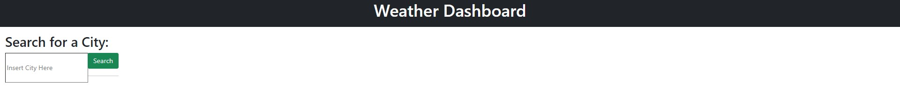

# Weather-Dashboard

  ## Table of Contents

  * [Acceptance Criteria](#acceptance-criteria)
  * [Links](#links)  
  * [Usage](#usage)
  * [Future Work](#future-work)
  * [API](#api)
  * [Repo Data](#repo)

## Acceptance Criteria

GIVEN a weather dashboard with form inputs
WHEN I search for a city
THEN I am presented with current and future conditions for that city and that city is added to the search history
WHEN I view current weather conditions for that city
THEN I am presented with the city name, the date, an icon representation of weather conditions, the temperature, the humidity, the wind speed, and the UV index
WHEN I view the UV index
THEN I am presented with a color that indicates whether the conditions are favorable, moderate, or severe
WHEN I view future weather conditions for that city
THEN I am presented with a 5-day forecast that displays the date, an icon representation of weather conditions, the temperature, the wind speed, and the humidity
WHEN I click on a city in the search history
THEN I am again presented with current and future conditions for that city

## Links

	[Deployed Application](https://renbryant.github.io/Weather-Dashboard/)

## Usage
In this app the user will be able to search up a city using the search bar. That will automatically look through the API to find information on the weather in that city. It will pop up a current weather section at the top and show the temperature, humidity, wind speed, uvi, and also the name of the city that was searched. Then there should be a five day forecast declaring the same thing but five days in advance. The UVI changes color based on weather it's favorable, moderate, or severe.

## Future Work
There is a lot that needed to be worked on for this application, I just wanted to give an update. I have worked on the JavaScript of this application and ran into a few errors. One of the main issues that I am having with this application, however is the local storage and recent searches features. If anyone can direct me to resources on those, that would be beneficial. However, I did add a 5-day forcast function. Which may or may not have stopped the current forecast function. Not sure why I'm struggling with this one so hard, but will definitely still work on it after I finish the class, if not for my ego then for my portfolio.

## API
This project uses the Open Weather Map API to pull weather information from the database.
[Link to Open Weather Map API website](https://openweathermap.org/api/one-call-api)

## Repo Data
This repo was contributed by RenBryant. I am a computer science student, a full-time worker, and a coding enthusiast! I love learning new things about computers and how they work and enjoy working on projects. Here is my GitHub Profile! [RenBryant](https://github.com/RenBryant). Thank you for checking out this project!